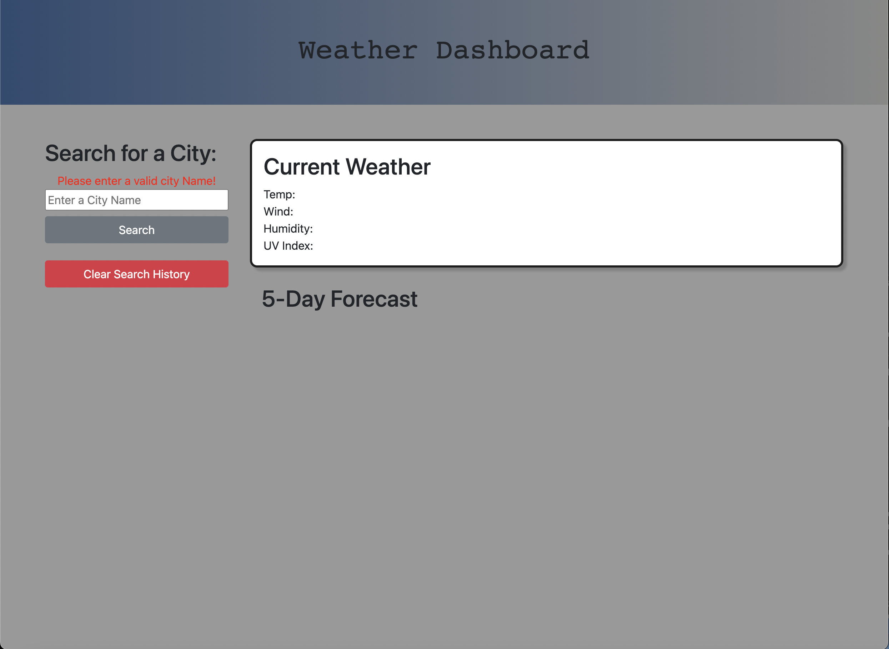

# Weather-Dashboard-

Week-6-Weather-Dashboard

## Description

The purpose of this project was to build a weather application that could retrieve data from a 3rd party api and display weather data from different geographical locations. This project was built to show my understanding with local storage, as well as 3rd party api's. This application solves a problem, where someone can go to the application and pull up previously searched cities or type in new cities and show the current forecast as well as the 5 day forecast. During this project, I learned how to use bootstrap, javascript and local storage as well as a 3rd party api from openweathermaps.

## Table of Contents (Optional)

Not applicable

## Installation

Can be accessed in the browser at https://dakota32jones.github.io/Weather-Dashboard-/

## Usage

Provide instructions and examples for use. Include screenshots as needed.

To add a screenshot, create an `assets/images` folder in your repository and upload your screenshot to it. Then, using the relative filepath, add it to your README using the following syntax:

## Credits

Not applicable

## License

MIT License

Copyright (c) [2022] [Dakota Jones]

Permission is hereby granted, free of charge, to any person obtaining a copy
of this software and associated documentation files (the "Software"), to deal
in the Software without restriction, including without limitation the rights
to use, copy, modify, merge, publish, distribute, sublicense, and/or sell
copies of the Software, and to permit persons to whom the Software is
furnished to do so, subject to the following conditions:

The above copyright notice and this permission notice shall be included in all
copies or substantial portions of the Software.

THE SOFTWARE IS PROVIDED "AS IS", WITHOUT WARRANTY OF ANY KIND, EXPRESS OR
IMPLIED, INCLUDING BUT NOT LIMITED TO THE WARRANTIES OF MERCHANTABILITY,
FITNESS FOR A PARTICULAR PURPOSE AND NONINFRINGEMENT. IN NO EVENT SHALL THE
AUTHORS OR COPYRIGHT HOLDERS BE LIABLE FOR ANY CLAIM, DAMAGES OR OTHER
LIABILITY, WHETHER IN AN ACTION OF CONTRACT, TORT OR OTHERWISE, ARISING FROM,
OUT OF OR IN CONNECTION WITH THE SOFTWARE OR THE USE OR OTHER DEALINGS IN THE
SOFTWARE.

🏆 The previous sections are the bare minimum, and your project will ultimately determine the content of this document. You might also want to consider adding the following sections.

## Badges

Not applicable

## Features

Not applicable

## How to Contribute

Not applicable

## Tests

Not applicable
